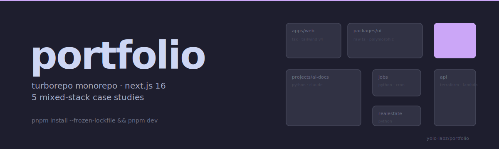
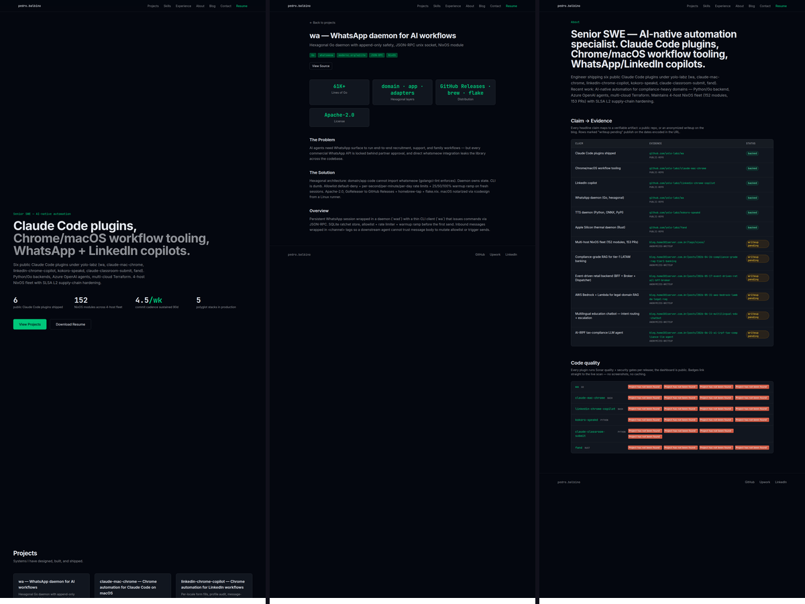

<picture>
  <source media="(prefers-color-scheme: dark)" srcset="docs/assets/hero-dark.svg">
  <source media="(prefers-color-scheme: light)" srcset="docs/assets/hero-light.svg">
  
</picture>

<div align="center">

# portfolio

**Turborepo monorepo housing the Next.js 16 portfolio site + 4 mixed-stack project case studies.**

Live at [pedro.home301server.com.br](https://pedro.home301server.com.br/). One pnpm workspace, one Turbo task graph, one Dockerfile, one Dokku push. The site, the shared UI library, and four project subfolders (TypeScript + Python + Terraform) all build and lint under a single command.

[](https://github.com/yolo-labz/portfolio/actions/workflows/ci.yml)
[](https://github.com/yolo-labz/portfolio/actions/workflows/visual-regression.yml)
[](./LICENSE)
[](https://conventionalcommits.org)
[](./apps/web)
[](./turbo.json)
[](https://scorecard.dev/viewer/?uri=github.com/yolo-labz/portfolio)

[Capability](#capability) · [Demo](#demo) · [How portfolio compares](#how-portfolio-compares) · [Stack](#stack) · [Layout](#layout) · [Run locally](#run-locally) · [CI](#ci)

</div>

---

## Capability

**Pattern.** Turborepo monorepo housing a Next.js 16 portfolio site, a shared `packages/ui` component library exported as raw TypeScript source (no build step), and 4 mixed-stack project case-study subfolders (TypeScript + Python + Terraform) wired into a single Turbo task graph.

**Trade-off.** Monorepo tooling overhead — pnpm workspaces, Turbo remote cache, Biome 2.x as the single lint+format authority — in exchange for a shared component library, atomic deploys, and one CI workflow that lints, type-checks, builds, and visual-regresses every workspace on every push.

**Use when.** Shipping a portfolio that needs to host multiple capability case-studies (AI document processor, executive job board, real-estate price tracker, serverless data API) on a single domain, with a single deploy surface, and a single design system.

```bash
pnpm install --frozen-lockfile
pnpm dev          # Next.js dev on apps/web (Turbopack)
pnpm build        # Turbo build of all apps + packages
pnpm lint         # Biome check across the workspace
pnpm typecheck    # tsc --noEmit across all workspaces
pnpm test:visual  # Playwright toHaveScreenshot visual-regression suite
```

## Demo

Static screenshot grid of the live site at three different routes (home view, project detail, about) rendered from the production build at [pedro.home301server.com.br](https://pedro.home301server.com.br/). 1200x900 PNG, no autobiographical text overlay.



The grid is reproducible from the live build with [`docs/assets/portfolio-grid.html`](./docs/assets/portfolio-grid.html) (which also contains the regeneration recipe).

## How `portfolio` compares

Closest peers in the Next.js-portfolio-template ecosystem:

| Capability                                            | `portfolio` (this repo) | [`create-next-app`](https://nextjs.org/docs/api-reference/create-next-app) | [Tailwind UI templates](https://tailwindui.com/templates) |
|-------------------------------------------------------|:---:|:---:|:---:|
| Turborepo monorepo + shared `packages/ui`             | yes | no  | no  |
| 4 mixed-stack project subfolders (TS + Python)        | yes | no  | no  |
| Dokku continuous deploy on `main`                     | yes | manual | manual |
| Tagged release path (SLSA L2 + dual SBOM)             | yes | no  | no  |
| Biome 2.x (single lint + format authority)            | yes | ESLint + Prettier | ESLint + Prettier |
| SHA-pinned actions + Dependabot                       | yes | optional | optional |
| Playwright `toHaveScreenshot` visual-regression CI    | yes | no  | no  |
| `no-ai-slips` lint (bans AI-generated copy patterns)  | yes | no  | no  |
| SonarCloud static analysis                            | yes | no  | no  |
| `pnpm dev` runs Turbopack + workspace graph           | yes | one app only | one app only |

For sites that need none of this — a single `apps/web` with no shared library, no project case-studies, no monorepo orchestration — [`create-next-app`](https://nextjs.org/docs/api-reference/create-next-app) is the right answer. This repo's overhead pays off only once you have 2+ stacks to deploy and a shared design system to enforce.

## Stack

- Node.js >=22, pnpm 10.28.2, TypeScript 6.0
- Next.js 16.2 (App Router, React 19.2, Tailwind CSS 4.3)
- Turborepo 2.9 task graph + remote caching
- Python 3.12 in `projects/` subprojects (pyenv-pinned via `.python-version`)
- Biome 2.5 (lint + format)
- Playwright 1.61 visual-regression CI
- Dokku continuous deploy on push to `main` (Dockerfile.dokku)

## Layout

```
apps/web/                       # Next.js portfolio site (the only deployable app)
packages/ui/                    # shared component library, raw TS source (no build step)
projects/                       # portfolio project subfolders
ai-document-processor/
exec-job-board/
realestate-price-tracker/
serverless-data-api/
scripts/                        # setup-dokku.sh + marketing-apply-repo-metadata.sh
.github/workflows/              # ci, deploy-dokku, no-ai-slips, sonar, terraform,
                                # visual-regression, collect-jobs
specs/                          # spec-driven-development feature specs
.specify/memory/constitution.md # repo principles (Sell-Don't-Tell, No AI Slop, etc.)
```

Workspace boundaries are governed by `.specify/memory/constitution.md` Principle III
(Monorepo Discipline): `apps/web` is the only deployable; `packages/ui` exports raw
TS via `transpilePackages`; `projects/*` are thin wrappers around their own toolchains.

## Run locally

```bash
pnpm install --frozen-lockfile
pnpm dev          # Turborepo dev task graph (Next.js dev server on apps/web)
pnpm lint         # Biome check
pnpm typecheck    # tsc --noEmit across workspaces
pnpm build        # Turborepo build of all apps + packages
pnpm test:visual  # Playwright visual-regression suite
```

## CI

Every push and PR runs:

- `ci.yml`            lint, typecheck, build
- `visual-regression.yml`  Playwright screenshot diff against committed baselines
- `no-ai-slips.yml`   bans the banned-phrase list from `.specify/memory/constitution.md` §V
- `sonar.yml`         SonarCloud static analysis
- `deploy-dokku.yml`  on push to `main`, deploy `apps/web` to Dokku

## License

MIT - see [LICENSE](./LICENSE).

---

## Services

Compliance-grade AI architecture for regulated workloads - async-first, USD-denominated, LATAM-based / EN-fluent. See [blog.home301server.com.br/services](https://blog.home301server.com.br/services/).

## Related

- [`yolo-labz/wa`](https://github.com/yolo-labz/wa) - WhatsApp daemon
- [`yolo-labz/.github`](https://github.com/yolo-labz/.github) - org profile + supply-chain story
