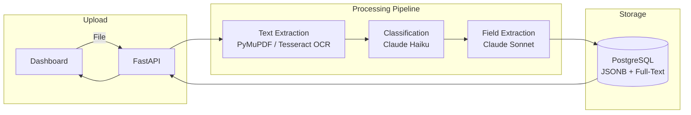

# AI Document Processing Pipeline

Upload PDFs, images, or DOCX files. The system extracts text (OCR for scanned documents), classifies the document type using AI, and pulls out structured fields — vendor names, amounts, dates, parties — automatically.

[Live Demo](https://ai-docs.home301server.com.br) · [Portfolio](https://portfolio.home301server.com.br)

## What This Demonstrates

- **AI-powered classification** — Claude identifies document types (invoice, contract, receipt) with confidence scores
- **Structured field extraction** — AI extracts vendor, amount, dates, line items into clean JSON
- **Multi-format pipeline** — PDF (text + scanned), JPEG/PNG images, DOCX — with automatic OCR fallback
- **Full-stack architecture** — FastAPI backend, PostgreSQL with JSONB + full-text search, Next.js dashboard
- **Docker orchestration** — One command to run the entire stack

## Architecture



## Processing Flow

| Step | What Happens | Tool |
|------|-------------|------|
| 1. Upload | File validated (type, size) and saved | FastAPI |
| 2. Text Extraction | Direct extraction for PDFs/DOCX, OCR for images/scans | PyMuPDF, Tesseract |
| 3. Classification | AI identifies document type with confidence | Claude Haiku |
| 4. Field Extraction | AI pulls structured fields based on type | Claude Sonnet |
| 5. Storage | Results stored with full-text search index | PostgreSQL JSONB |

## Tech Stack

| Layer | Technology |
|-------|-----------|
| Backend | Python 3.12, FastAPI, SQLAlchemy (async) |
| AI | Claude Haiku (classification), Claude Sonnet (extraction) |
| OCR | Tesseract, PyMuPDF, pdf2image |
| Database | PostgreSQL 16, JSONB, TSVECTOR full-text search |
| Frontend | Next.js 16, Tailwind CSS v4 |
| Infrastructure | Docker Compose |

## Quick Start

```bash
cd projects/ai-document-processor
cp .env.example .env
# Edit .env: add ANTHROPIC_API_KEY=sk-ant-...

docker compose up -d
open http://localhost:3000
```

## API Endpoints

| Method | Path | Description |
|--------|------|-------------|
| POST | /api/documents/upload | Upload a document |
| GET | /api/documents | List documents (paginated, searchable) |
| GET | /api/documents/{id} | Get document with extracted data |
| GET | /health | Health check |

## Cost

~$0.006 per document (Haiku classification + Sonnet extraction). The system works without an API key — it extracts text but skips AI classification.

## License

MIT
