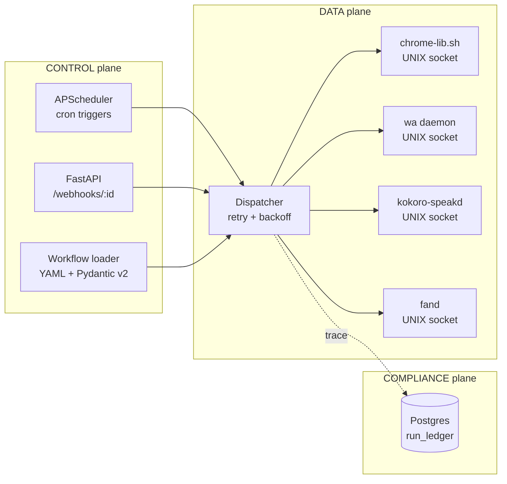

# Automation Hub — Self-Hosted Workflow Orchestrator

> **Status: DESIGN / RFC — not yet implemented.** This document describes the
> intended architecture and API. There is no shipped code in this directory yet;
> the snippets below (workflow DSL, fitness-function test) are proposed, not running.

Planned capability: a YAML-defined workflow engine that wires cron schedules and HTTP webhooks into a fan-out RPC layer over a fleet of single-purpose daemons (Chrome driver, WhatsApp daemon, TTS daemon, thermal monitor). Workflows declare `on:` triggers (cron / webhook / file-watch) and `steps:` that dispatch to daemon Unix sockets, with retries, structured logs, and a Postgres-backed run ledger.

[Live Demo](https://automation-hub.home301server.com.br) (soon) · [Portfolio](https://portfolio.home301server.com.br)

## What This Demonstrates

- **Workflow-as-code** — YAML DSL with typed `on/when/steps/retry` schema validated at load via Pydantic v2
- **RPC fan-out over Unix sockets** — adapter-per-daemon (port-and-adapter), JSON-RPC line protocol, no HTTP overhead on the loopback
- **Cron + webhook unified scheduler** — APScheduler in-process, FastAPI webhook receiver, single event loop
- **Run ledger with replay** — every step's `(workflow_id, step_id, input_hash, output_hash, model_v)` written to Postgres for audit + dry-run replay
- **Self-healing** — exponential backoff on transient daemon errors, dead-letter queue for steps that exhaust retries, structured `slog`-style JSON logs to Loki
- **Single-binary deploy** — `uv build` → wheel → Dockerfile → `dokku push`. No k8s, no message broker

## Architecture (C4 Container)



*fig. 1 — Container view · 3-plane layout. Daemons are not microservices; they are the existing single-purpose binaries already running on this host.*

> In the context of a fleet of single-purpose daemons each owning one capability (Chrome, WhatsApp, TTS, thermal), facing the temptation to merge them into a monolith for "easier orchestration", we decided to keep the daemons standalone and add a thin coordinator over Unix sockets to achieve sub-5ms dispatch latency, accepting one extra YAML file per workflow.

## Tech Stack

| Layer | Technology |
|-------|-----------|
| Runtime | Python 3.12, asyncio, uv |
| API | FastAPI, Pydantic v2 |
| Scheduler | APScheduler 3.x (in-process cron) |
| RPC | Unix domain sockets, JSON-RPC line protocol |
| Storage | PostgreSQL 16 (run_ledger), JSONB |
| Observability | structlog → Loki, Prometheus metrics |
| Deploy | Dokku, single Docker container |

## Workflow DSL example

```yaml
# workflows/morning-brief.yaml
on:
  cron: "0 7 * * 1-5"
steps:
  - id: weather
    socket: /run/automation-hub/fetch.sock
    method: http.get
    params: { url: "https://wttr.in/Recife?format=3" }
  - id: speak
    socket: /run/kokoro-speakd.sock
    method: tts.speak
    params: { text: "${{ steps.weather.output }}" }
retry:
  max_attempts: 3
  backoff: exponential
```

## Fitness function (proposed — not yet implemented)

```python
# tests/test_dispatch_latency.py — would fail CI if p95 dispatch regresses
def test_dispatch_p95_under_envelope(loaded_socket_pool):
    metrics = run_n(1000, dispatch_noop)
    assert metrics.p95_ms < 5, f"latency regression: {metrics.p95_ms}ms"
```

## Anti-pattern called out

Reaching for a message broker (RabbitMQ / Redis Streams / NATS) at this scale is the classic over-engineering trap — for ≤4 daemons on one host, broker round-trips dwarf the actual work. Unix sockets give you ordering, backpressure, and process isolation without operational overhead. Add a broker only when fan-out crosses the host boundary.

## References

- Hexagonal Architecture — Cockburn (2005), `alistair.cockburn.us`
- APScheduler 3.x docs — interval/cron/date triggers
- Pydantic v2 — model validation & schema contracts (`docs.pydantic.dev`)
- PostgreSQL 16 — JSONB indexing & FOR UPDATE SKIP LOCKED ledger pattern
- structlog — structured logging in Python (`structlog.org`)

## License

MIT
