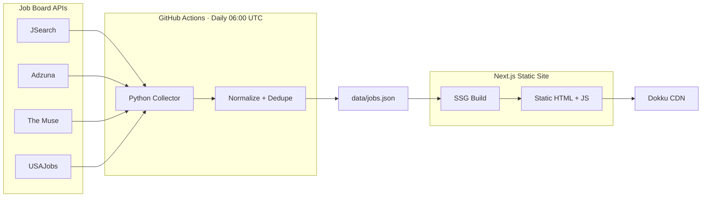

# Executive Job Board Aggregator

Automated daily pipeline that collects executive-level job listings from 4 public APIs, normalizes and deduplicates them, and serves a fast static site with search and filtering.

[Live Demo](https://exec-job-board.home301server.com.br) · [Portfolio](https://portfolio.home301server.com.br)

## What This Demonstrates

- **Multi-source API integration** — 4 job board APIs with unified data schema
- **Data normalization** — Pydantic models, SHA-256 deduplication, seniority classification
- **Automated pipeline** — GitHub Actions runs daily, commits fresh data, deploys automatically
- **Static site generation** — Next.js builds from JSON at compile time, zero runtime costs
- **Client-side search** — Fuse.js fuzzy search + 4-dimension filtering, under 200ms

## Architecture



## Data Pipeline

| Source | API Type | Auth | Typical Yield |
|--------|----------|------|---------------|
| JSearch | REST (RapidAPI) | API Key | ~40-80 exec roles |
| Adzuna | REST | App ID + Key | ~30-60 exec roles |
| The Muse | REST (public) | None | ~20-40 exec roles |
| USAJobs | REST | API Key + Email | ~30-50 federal roles |

Each source has its own adapter that handles API-specific response formats, rate limiting (exponential backoff on 429), and normalization to a shared Pydantic model.

## Tech Stack

| Layer | Technology |
|-------|-----------|
| Collection | Python 3.12, httpx, Pydantic v2 |
| Automation | GitHub Actions (daily cron) |
| Frontend | Next.js 16, Tailwind CSS v4 |
| Search | Fuse.js (client-side fuzzy search) |
| Hosting | Dokku (self-hosted) |

## Running Locally

### Collector

```bash
cd projects/exec-job-board
python3 -m venv .venv && source .venv/bin/activate
pip install -r requirements.txt

# Set API keys (optional — site works with seed data without them)
export JSEARCH_API_KEY="..."
export ADZUNA_APP_ID="..."
export ADZUNA_API_KEY="..."

python -m collector.main
```

### Site

```bash
cd projects/exec-job-board/site
pnpm install
pnpm dev
# Open http://localhost:3001
```

The site reads `data/jobs.json` at build time. If no `jobs.json` exists, it falls back to `data/seed.json` (30 curated sample listings).

## Project Structure

```
projects/exec-job-board/
├── collector/           # Python data pipeline
│   ├── sources/         # One adapter per API
│   ├── models.py        # Pydantic NormalizedJob
│   ├── dedup.py         # Hash-based dedup + seniority classifier
│   └── main.py          # Orchestrator
├── site/                # Next.js frontend
│   └── src/
│       ├── app/         # Pages, RSS feed, health check
│       ├── components/  # JobBoard, JobCard, FilterBar, StatsBar
│       └── lib/         # Types, search hook
├── data/
│   ├── jobs.json        # Pipeline output (updated daily)
│   └── seed.json        # Fallback seed dataset
└── README.md
```

## License

MIT
