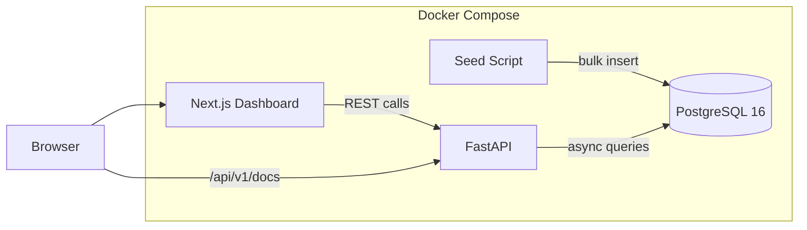

# Real Estate Price Tracker Dashboard

Full-stack dashboard tracking real estate market data for Austin, TX. FastAPI backend with PostgreSQL, Next.js frontend with interactive charts and map, orchestrated via Docker Compose.

[Live Demo](https://realestate-tracker.home301server.com.br) · [Portfolio](https://portfolio.home301server.com.br)

## What This Demonstrates

- **Full-stack API architecture** — FastAPI serving REST endpoints, Next.js consuming them
- **Database design** — PostgreSQL with indexed queries, aggregate statistics, export
- **Data visualization** — Recharts line/bar charts + Leaflet map with color-coded markers
- **Docker orchestration** — PostgreSQL + API + Dashboard in a single `docker compose up`
- **Synthetic data pipeline** — 800 realistic property listings seeded from a Python generator

## Architecture



## Data Pipeline

The seed script generates 800 synthetic listings across 6 Austin neighborhoods:

| Neighborhood | ZIP | Price Range | Listings |
|-------------|-----|------------|----------|
| Downtown | 78701 | $500k–$1.2M | ~130 |
| East Austin | 78702 | $350k–$700k | ~140 |
| South Congress | 78704 | $400k–$900k | ~130 |
| Mueller | 78723 | $300k–$600k | ~140 |
| Round Rock | 78664 | $250k–$450k | ~130 |
| Cedar Park | 78613 | $280k–$500k | ~130 |

Prices follow a Gaussian distribution around each neighborhood's median. Square footage correlates with bedroom count. Listing dates span 12 months.

## Tech Stack

| Layer | Technology |
|-------|-----------|
| Backend | Python 3.12, FastAPI, SQLAlchemy (async), asyncpg |
| Database | PostgreSQL 16 |
| Frontend | Next.js 16, Recharts, React-Leaflet, Tailwind CSS v4 |
| Infrastructure | Docker Compose |
| Hosting | Dokku (self-hosted) |

## API Endpoints

| Method | Path | Description |
|--------|------|-------------|
| GET | `/health` | Health check |
| GET | `/api/v1/listings` | Paginated listings with filters |
| GET | `/api/v1/listings/geo` | Lightweight lat/lng data for map |
| GET | `/api/v1/stats` | Aggregate market statistics |
| GET | `/api/v1/export/csv` | CSV export (filtered) |
| GET | `/api/v1/export/json` | JSON export (filtered) |

All endpoints accept filters: `neighborhood`, `min_price`, `max_price`, `bedrooms`, `min_date`, `max_date`.

## Running Locally

```bash
cd projects/realestate-price-tracker

# Copy env template
cp .env.example .env

# Start all services
docker compose up -d

# Seed database (first time)
docker compose --profile seed up seed

# Open dashboard
open http://localhost:3000

# API docs (Swagger)
open http://localhost:8000/docs
```

## Project Structure

```
projects/realestate-price-tracker/
├── api/                    # FastAPI backend
│   ├── app/
│   │   ├── main.py         # App setup, CORS, routers
│   │   ├── models.py       # SQLAlchemy Listing model
│   │   ├── routers/        # listings, stats, export
│   │   └── seed.py         # Synthetic data generator
│   └── Dockerfile
├── dashboard/              # Next.js frontend
│   └── src/
│       ├── app/            # Pages, layout, styles
│       ├── components/     # Map, charts, KPIs, filters
│       └── lib/            # API client, types
├── docker-compose.yml      # Orchestration
└── README.md
```

## License

MIT
