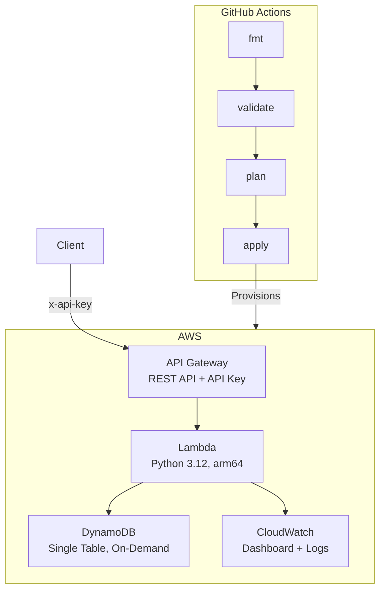

# Serverless Data API — Terraform + AWS

Production-ready serverless CRUD API provisioned entirely via Terraform. API Gateway with API key authentication and rate limiting, Lambda (Python 3.12) with structured logging, DynamoDB with single-table design, and CloudWatch monitoring — all created with `terraform apply`.

[Portfolio](https://portfolio.home301server.com.br)

## What This Demonstrates

- **Full Infrastructure-as-Code** — `terraform apply` creates 15 resources, `terraform destroy` removes them all
- **Modular Terraform** — 5 reusable modules (DynamoDB, IAM, Lambda, API Gateway, Monitoring)
- **Serverless CRUD API** — Lambda + API Gateway with validation, auth, and rate limiting
- **Zero-cost architecture** — on-demand DynamoDB + Lambda free tier = $0/month when idle
- **CI/CD governance** — GitHub Actions validates Terraform on every PR

## Architecture



## Terraform Modules

| Module | Resources | Purpose |
|--------|-----------|---------|
| `dynamodb` | Table + GSI | Single-table design, on-demand, PITR enabled |
| `iam` | Role + Policies | Least-privilege Lambda execution role |
| `lambda` | Function + Layer | Python 3.12 on arm64 with Powertools |
| `api_gateway` | REST API + Key + Plan | API key auth, 1000 req/day rate limit |
| `monitoring` | Dashboard | 8 widgets: invocations, latency, errors, capacity |

## What Gets Created

```
Plan: 15 to add, 0 to change, 0 to destroy.

  + aws_dynamodb_table.main          (PAY_PER_REQUEST, PK/SK + GSI1)
  + aws_iam_role.lambda_role         (Lambda execution role)
  + aws_iam_role_policy.dynamodb     (DynamoDB CRUD permissions)
  + aws_lambda_function.api_handler  (Python 3.12, arm64, 256MB)
  + aws_api_gateway_rest_api.api     (Regional REST API)
  + aws_api_gateway_resource.proxy   ({proxy+} catch-all)
  + aws_api_gateway_method.any       (ANY with API key required)
  + aws_api_gateway_integration      (Lambda AWS_PROXY)
  + aws_api_gateway_deployment       (Demo stage)
  + aws_api_gateway_stage.demo       (Stage: demo)
  + aws_api_gateway_api_key.demo     (Authentication key)
  + aws_api_gateway_usage_plan       (1000/day, burst 10)
  + aws_lambda_permission            (API Gateway invoke)
  + aws_cloudwatch_dashboard         (8 metric widgets)
```

Full plan output: [docs/plan-output.txt](./docs/plan-output.txt)

## Quick Start

```bash
cd projects/serverless-data-api/infra

# Initialize
terraform init

# Preview
terraform plan

# Deploy (~3 min)
terraform apply

# Get credentials
API_URL=$(terraform output -raw api_url)
API_KEY=$(terraform output -raw api_key_value)

# Test
curl -X POST "$API_URL/items" \
  -H "x-api-key: $API_KEY" \
  -H "Content-Type: application/json" \
  -d '{"name": "Test", "category": "demo", "price": 9.99}'

curl "$API_URL/items" -H "x-api-key: $API_KEY"
```

## API Endpoints

| Method | Path | Description | Auth |
|--------|------|-------------|------|
| POST | /items | Create item | API key |
| GET | /items | List items | API key |
| GET | /items/{id} | Get item by ID | API key |
| PUT | /items/{id} | Update item | API key |
| DELETE | /items/{id} | Delete item | API key |
| GET | /docs | Swagger UI | None |
| GET | /openapi.json | OpenAPI spec | None |

## Cost

**$0/month when idle.** No always-on resources.

| Resource | Pricing Model | Idle Cost |
|----------|--------------|-----------|
| DynamoDB | On-demand (per request) | $0 |
| Lambda | Per invocation (1M free/month) | $0 |
| API Gateway | Per request ($3.50/M) | $0 |
| CloudWatch | Dashboard ($3/month) | $3 |

Total with dashboard: ~$3/month. Without: $0.

## Cleanup

```bash
terraform destroy
```

All 15 resources removed. No orphans.

## Project Structure

```
projects/serverless-data-api/
├── infra/
│   ├── main.tf              # Wires 5 modules
│   ├── variables.tf          # project_name, environment, region
│   ├── outputs.tf            # API URL, key, table, dashboard
│   └── modules/
│       ├── dynamodb/         # Table + GSI
│       ├── iam/              # Lambda role + policies
│       ├── lambda/           # Function + Layer
│       ├── api_gateway/      # REST API + auth + rate limit
│       └── monitoring/       # CloudWatch dashboard
├── lambda_src/
│   ├── handler.py            # Powertools CRUD routes
│   ├── models.py             # Pydantic validation
│   └── db.py                 # DynamoDB wrapper
├── openapi.yaml              # API specification
└── docs/
    ├── plan-output.txt       # Sample terraform plan
    └── architecture.md       # Mermaid diagram
```

## License

MIT
