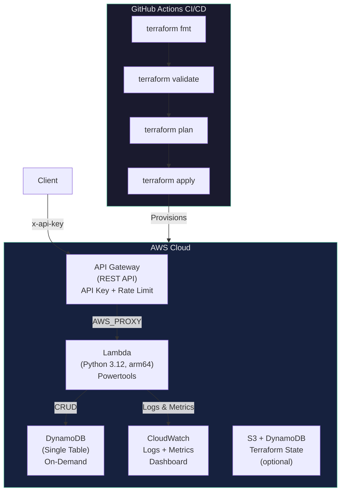

```mermaid
flowchart TB
    subgraph CI["GitHub Actions CI/CD"]
        FMT[terraform fmt] --> VAL[terraform validate]
        VAL --> PLAN[terraform plan]
        PLAN --> APPLY[terraform apply]
    end

    subgraph AWS["AWS Cloud"]
        APIGW["API Gateway\n(REST API)\nAPI Key + Rate Limit"]
        LAMBDA["Lambda\n(Python 3.12, arm64)\nPowertools"]
        DYNAMO["DynamoDB\n(Single Table)\nOn-Demand"]
        CW["CloudWatch\nLogs + Metrics\nDashboard"]
        S3["S3 + DynamoDB\nTerraform State\n(optional)"]
    end

    CLIENT[Client] -->|x-api-key| APIGW
    APIGW -->|AWS_PROXY| LAMBDA
    LAMBDA -->|CRUD| DYNAMO
    LAMBDA -->|Logs & Metrics| CW
    APPLY -->|Provisions| AWS

    style CI fill:#1a1a2e,stroke:#5ec4a0,color:#e8e8ec
    style AWS fill:#16213e,stroke:#5ec4a0,color:#e8e8ec
```
